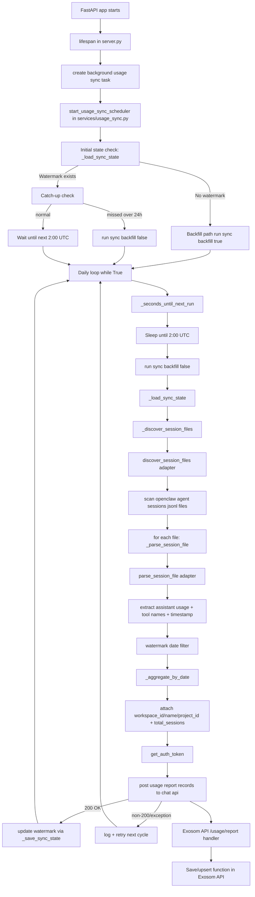

# OpenClaw Usage Sync Flow

```mermaid
flowchart TD
    A[FastAPI app starts] --> B[lifespan in server.py]
    B --> C[create background usage sync task]
    C --> D[start_usage_sync_scheduler in services/usage_sync.py]

    D --> E[Initial state check: _load_sync_state]
    E -->|No watermark| F[Backfill path run sync backfill true]
    E -->|Watermark exists| G[Catch-up check]
    G -->|missed over 24h| H[run sync backfill false]
    G -->|normal| I[Wait until next 2:00 UTC]

    F --> J[Daily loop while True]
    H --> J
    I --> J
    J --> K[_seconds_until_next_run]
    K --> L[Sleep until 2:00 UTC]
    L --> M[run sync backfill false]

    M --> N[_load_sync_state]
    N --> O[_discover_session_files]
    O --> P[discover_session_files adapter]
    P --> Q[scan openclaw agent sessions jsonl files]

    Q --> R[for each file: _parse_session_file]
    R --> S[parse_session_file adapter]
    S --> T[extract assistant usage + tool names + timestamp]

    T --> U[watermark date filter]
    U --> V[_aggregate_by_date]
    V --> W[attach workspace_id/name/project_id + total_sessions]
    W --> X[get_auth_token]
    X --> Y[post usage report records to chat api]

    Y -->|200 OK| Z[update watermark via _save_sync_state]
    Y -->|non-200/exception| AA[log + retry next cycle]
    Z --> J
    AA --> J

    Y --> AB[Exosom API /usage/report handler]
    AB --> AC[Save/upsert function in Exosom API]
```
