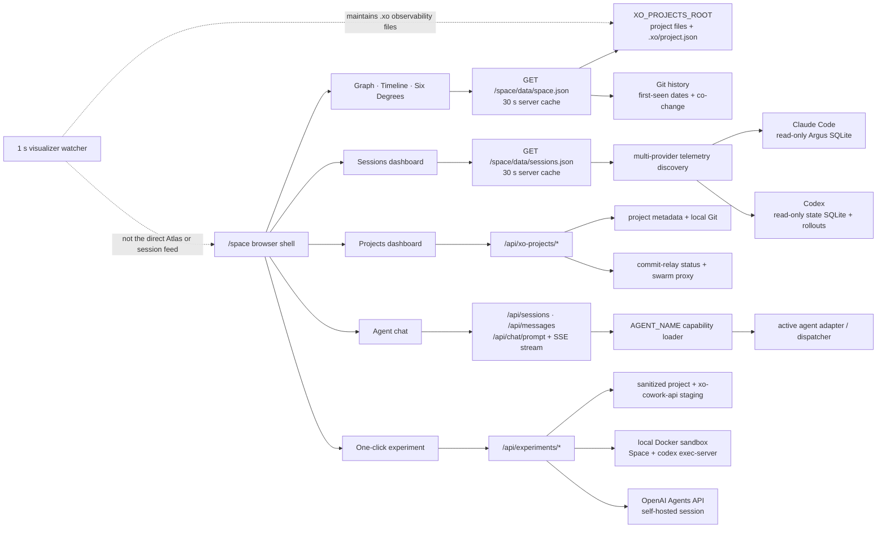

# `/space` — product and architecture one-pager

> Audited on 19 July 2026 on `feat/commit-telepathy`, using the running UI at
> `http://127.0.0.1:5002/space/`, its local APIs, and the implementation source.

## What it is

`/space` is a local-first workspace cockpit for XO. It turns a directory full of
projects, Git histories, agent telemetry, collaboration state, and agent sessions
into one navigable UI. Its job is not to be another editor. Its job is to answer:

- What work exists, and where does it live?
- When did it appear, and what evolved together?
- How are two artifacts connected?
- Where are agent time, tokens, cost, models, and tools going?
- Which projects are local, shared, behind, or waiting on setup?
- Can I move from observing the workspace to asking an agent to act in a project?

The strongest utility is **orientation plus transition to action**. Graph,
Timeline, and Six Degrees help a person build a mental model; Sessions explains
agent usage; Projects exposes collaboration state; Chat lets the person continue
inside a selected project; Experiment creates a boot-verified isolated project
agent and interactive sandbox Space in one click. This makes `/space` most useful as an engineering
lead's or operator's home screen, an onboarding map, and a future agent control
surface.

## What the UI contains

The build-free ES-module SPA has a persistent header, seven hash-routed views, a
global graph search/re-root control, a shared detail drawer/toast layer, and a
footer that polls server status.

| View | Purpose | Main source |
|---|---|---|
| Graph | Explore projects, directory clusters, artifacts, and derived relationships | Filesystem + Git |
| Timeline | Scrub and replay retained artifacts by first-seen date | Same Atlas graph |
| Six Degrees | Find a weighted shortest path between two artifacts | Same Atlas graph |
| Sessions | Compare or isolate Claude Code and Codex tokens, sessions, models, tools, and trends | Argus + Codex state/rollouts |
| Projects | Inspect project inventory, commits, relay state, and sharing | Project BFF + Git + swarm relay |
| Chat | Browse sessions and stream an agent response, optionally project-bound | Adapter-backed session/chat APIs |
| Experiment | Launch, inspect, message, and stop a short-lived isolated XO project agent | Docker/Space provider + early-access Agents API |

Routes are `#/graph`, `#/time`, `#/six`, `#/sessions`, `#/projects`, and
`#/chat`, and `#/experiment`; numeric shortcuts `1`–`7` select them. Views mount lazily once and keep
their in-memory state until a full page reload.

## How the parts connect

This separation matters: `/space` is one UI but not one database. Atlas is a
request-time filesystem/Git index, Sessions merges independent read-only Claude
Code and Codex projections, and Projects/Chat/Experiment are live operational
APIs. The visualizer watcher maintains `.xo`
state for the broader product, but Atlas does not read its stats/timeline output;
it only benefits indirectly when `.xo/project.json` makes a folder discoverable.

## How Atlas is calculated

Each scaffolded project becomes a hub. Root files and directory buckets become
clusters; retained files become leaves. Code, document, and other extensions map
to disc, ring, and diamond shapes. A file date is its first appearance in the
project's oldest-first Git history, falling back to mtime when Git is unavailable.

The index is deliberately bounded: at most 2,000 files scanned and 400 leaves
kept per project, 1,500 leaves globally, a 10-second build budget, and 60 derived
ties. Oldest leaves are dropped first. Ties come from repeated Git co-change
(at least three of the latest 500 non-bulk commits), text documents naming a
retained path, and `test_x`/`x` filename pairs. These ties are derived only
inside each project.

The frontend adds the hierarchy edges and lays nodes out with typed springs,
repulsion, collision handling, damping, and a velocity cap. Timeline uses a
linear date scale plus a small beeswarm to avoid overlapping dots. Six Degrees
uses weighted Dijkstra: derived tie `1`, artifact↔cluster `1.4`,
cluster↔project `2.4`, and project↔root `4.5`; the displayed degree count is raw
edge count, not weighted cost.

## Live snapshot from this audit

| Area | Observed state |
|---|---|
| Atlas | 35 hubs, 152 clusters, 1,500 retained artifacts, 40 ties, 34 milestones |
| Links | 1,727 = 35 hub edges + 152 cluster edges + 1,500 leaf edges + 40 ties |
| Timeline | 13 June–25 July 2026, including seven-day padding at each end |
| Projects | 36 rows but 35 unique IDs; one ID is emitted twice |
| Sessions, all time | 116 parent sessions (58 Claude Code + 58 Codex), 4,867,409,623 tokens, about $414.90 known Claude cost plus unavailable Codex cost, 33 project paths |
| Relay | Enabled but parked because `PROJECT_ID` is not configured; watch branch `main` |
| Chat | Session list, stored transcript, project binding, progressive text SSE, and abort UI all operational |
| Experiment | SDK/Docker/API preflight green; one-click launch, sandbox Space URL, follow-up turns, and cleanup are covered end-to-end |

The already-open page initially held 26 ties/1,713 links. Adding these audited
documents introduced more literal path references; a fresh server build derived
40 ties/1,727 links while the page retained its first dataset. That directly
validated both reference-based tie generation and the page-lifetime Atlas cache.

## Product boundaries and current risks

- Atlas is a recent, capped navigation aid—not a complete inventory or source of
  truth. A reload is required to see a newly built graph because the frontend
  retains its first fetch for the page lifetime.
- Marketing copy says “four departments” and “thirteen months,” while the live
  data has 35 hubs and a roughly six-week retained range. The footer says “local
  file” although the graph comes from a dynamic API.
- Cross-project semantic ties do not exist today; cross-project paths normally
  travel through the generic workspace root.
- The Projects BFF merges scaffolded and bare folders without deduplicating IDs.
  The live list currently contains one duplicate. Git commands run with
  `git -C <project-folder>` and can resolve to an ancestor repository, so nested
  project cards can show the same parent-repository commit feed. Opening Projects
  also fans out commit and member requests for every scaffolded card even while
  relay sharing is parked; 35 scaffolded rows currently create 70 follow-up
  requests, including avoidable swarm failures.
- Sessions has checked-by-default Claude Code and Codex source filters across
  every subview. Codex does not report authoritative cost, so combined cost is
  partial. Date windows are inclusive and can span one extra calendar date;
  Argus currently reports schema 3 while its reader expects schema 6 (warning
  only in this environment).
- Chat streams model text and coarse progress, but live tool/permission events
  are not represented. Tool details appear only after the canonical transcript
  is reloaded. Refresh cannot recover an in-flight stream, and Stop is primarily
  local—the agent may finish server-side.
- Experiment's first provider is intentionally local-development only. It
  hardens and limits Docker, sanitizes the current worktree, auto-stops, and
  reconciles labelled containers, but still assumes one trusted API process and
  places a long-lived project key inside the executor. Production Coder/XO
  needs durable owner-scoped state and short-lived executor credentials.
- `/space` data routes have no route-level authentication and expose absolute
  workspace/DB paths. They should remain local or sit behind a trusted proxy.
- Backend regressions cover Experiment lifecycle/snapshot/command/turn
  safety plus provider discovery/degradation, mixed-agent Argus data,
  single-flight API caching, Codex reconciliation/cache math, tools,
  zero-token parents and state-lag recovery, schema fallback, malformed numeric
  rows/rollouts, and privacy exclusions. The running browser verified combined, isolated, and all-off
  checkbox states across all five Sessions subviews. There is still no dedicated
  frontend unit/component test harness for `space_ui`.

## Agent SDK seam

Keep Atlas and telemetry as deterministic read models. Experiment now proves the
provider-neutral Agent SDK lifecycle, follow-up turn bridge, and sandbox Space
URL behind a dedicated BFF and registry view. A future slice can add replayable
typed tool events and durable transcript persistence while preserving the
local-first **observe → understand → act** loop.

See [FEATURE_INVENTORY.md](./FEATURE_INVENTORY.md) for the complete implemented
feature, calculation, endpoint, refresh, failure, and known-drift inventory.
